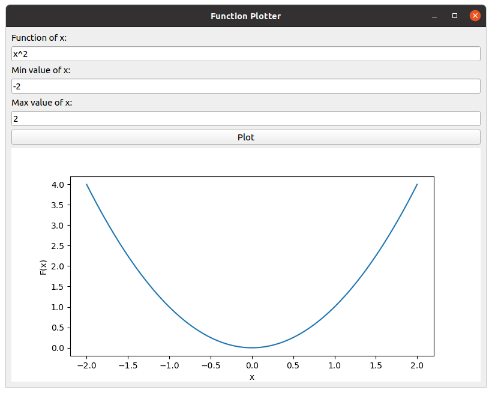

# Function Plotter

## Introduction
Python GUI program that plots an arbitrary user-entered function using Pyside2 and Matplotlib
and Pytest for automated testing
GUI which is 1)Take a function of x from the user, e.g., 5*x^3 + 2*x.
             2)Take min and max values of x from the user.

<p align="center">
  
</p>

## Dependencies
* For the program 
```python3
pip install PySide2
pip install numpy
pip install matplotlib
pip install os-sys
```
* For Automated tests
```python3
pip install pytest
pip install pytest-qt
```

## Usage

* Run [Codes/Function_Plotter.py](Codes/Function_Plotter.py) file.
```python3
python3 Function_Plotter.py
```
* In case of automated tests, run [Codes/test_Function_Plotter.py](Codes/test_Function_Plotter.py) file.
```python3
# you should start naming the file by "test_"
python3 test_Function_Plotter.py
pytest    # or pytest -v
```
